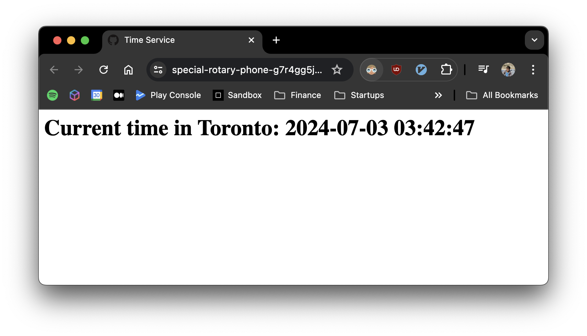

# Deploy a Python Application on Kubernetes

## Project Assets

| GitHub Repository | https://github.com/iammdsameer/clo835_s24/tree/master/project-2 |
| --- | --- |
| **DockerHub Repository** | **https://hub.docker.com/r/itsmdsameerkhan/clo835-project-two/tags** |

### **Project Overview**

In this project, we will deploy a Python web application that displays the current time in Toronto, Canada, using Kubernetes. The application will be containerized using Docker, and NodePort will be used to make it reachable. By the end, we will gain hands-on experience with containerization and orchestration using Docker and Kubernetes.

### Instructions

**Fork and Clone the Repository with Python application** 

[https://github.com/iammdsameer/clo835_s24/blob/master/project-2/app.py](https://github.com/iammdsameer/clo835_s24/blob/master/project-2/app.py)

Let’s now create a `Dockerfile` in the working directory as same as [`app.py`](http://app.py) file to containerize the existing application

```docker
# Get the latest python image
FROM python:latest
# Set working directory as /app
WORKDIR /app
# Copy the application file
COPY app.py .
# Run the python application
CMD ["python", "app.py"]
```

**Build and Push Docker Image**

```bash
docker login # provide proper credentials for DockerHub
docker build -t itsmdsameerkhan/clo835-project-two:v1 .
docker push itsmdsameerkhan/clo835-project-two:v1
```

Before we get started with Kubernetes, we will have to install it first.

```bash
curl -LO https://storage.googleapis.com/minikube/releases/latest/minikube-linux-amd64
sudo install minikube-linux-amd64 /usr/local/bin/minikube
minikube start
```

Now, we can interact with Kubernetes with `kubectl` CLI.

Let’s create our deployment file first called `deployment.yaml` with following contents:

```yaml
apiVersion: apps/v1
kind: Deployment
metadata:
  name: python-app
  labels:
    app: python-app
spec:
  replicas: 3
  selector:
    matchLabels:
      app: python-app
  template:
    metadata:
      labels:
        app: python-app
    spec:
      containers:
      - name: python-app
        image: itsmdsameerkhan/clo835-project-two:v1
        ports:
        - containerPort: 3030
        resources:
          limits:
            memory: "128Mi"
            cpu: "500m"
          requests:
            memory: "64Mi"
            cpu: "250m"
```


💡 Notice that for container image we used the image that has been published to DockerHub from earlier steps.


Now these containers won’t be accessible right away. For that we will take help from NodePort to expose the port 3030.

Create a `service.yaml` file with contents as such:

```yaml
apiVersion: v1
kind: Service
metadata:
  name: python-app-service
  labels:
    app: python-app
spec:
  type: NodePort
  selector:
    app: python-app
  ports:
    - protocol: TCP
      port: 3030
      targetPort: 3030
      nodePort: 30000
```

**Deploy to Kubernetes and the NodePort service**

```bash
kubectl create -f deployment.yaml
kubectl create -f service.yaml
```

To validate if the resources has been appropriately reflected, run

```bash
kubectl get deployments # should see a new deployment created
# then, for the service
kubectl get svc # should see a NodePort service
```

**Test the Application**

Now, let’s ensure the Kubernetes cluster is accessible and the application is running correctly.

```bash
kubectl get nodes -o wide
```

Note the IP of the node, we will need that later.

To see if our application is serving properly, make an HTTP GET request to the node IP followed by the NodePort instructed in the `service.yaml` file.

```bash
curl <node-ip-from-minikube>:30000
```

You should see result similar to this:



---

**You have reached the end!**
